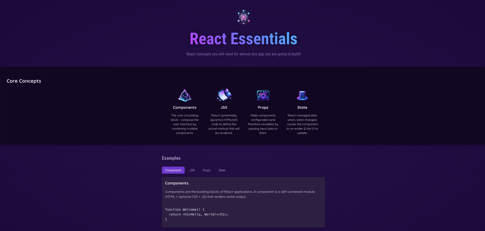

# react-projects

:rocket: My React learning path documented. 
> [!NOTE]
> All projects come from [this exquisite Udemy course](https://www.udemy.com/course/react-the-complete-guide-incl-redux).   

## Prerequisities
[Node.js](https://nodejs.org/en)

If you haven't yet, install the dependencies with `npm install`.
Run the desired react app with `npm start`.

## Projects

### 01-react-essentials
A basic React app with interactive components.

### 02-tic-tac-toe
Play interactive noughts and crosses game by yourself or with someone!

